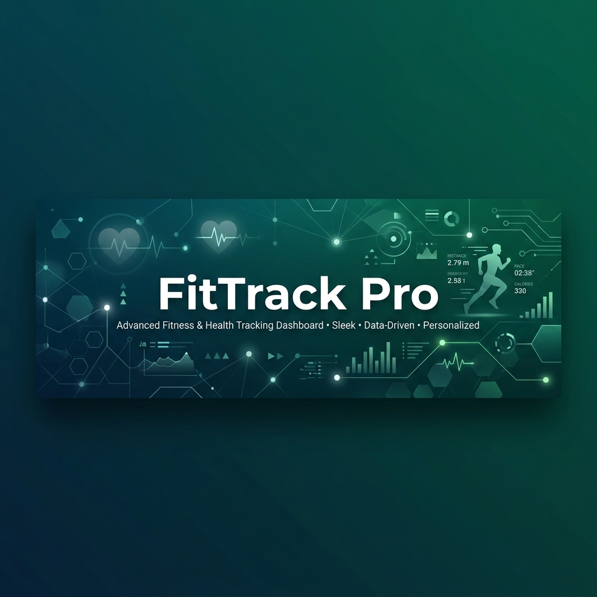
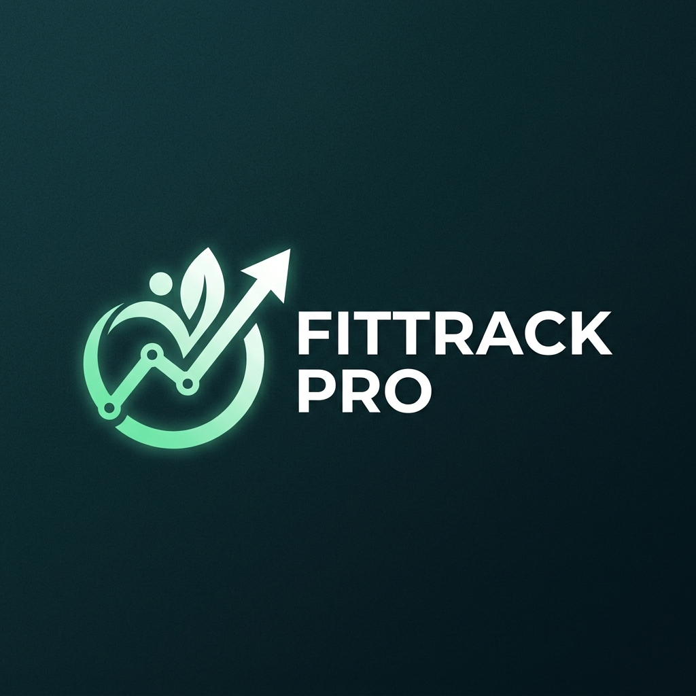

  
  
   
  
  

  # FitTrack Pro Ecosystem
  ### A Solução SaaS Definitiva para Profissionais de Saúde e Performance

  

    <a href="https://github.com/FitnessTrack/Backend">Backend</a> •
    <a href="https://github.com/FitnessTrack/Web">Portal Web</a> •
    <a href="https://github.com/FitnessTrack/Mobile">App Mobile</a> •
    <a href="https://github.com/FitnessTrack/Docs">Documentação</a>
  

---

## 🚀 Sobre o Projeto

O **FitTrack Pro** é uma plataforma multi-tenant completa, projetada para centralizar o acompanhamento de clientes para profissionais de **Educação Física** e **Nutrição**. O ecossistema integra agendamento inteligente, avaliações físicas e nutricionais detalhadas, prescrição de treinos e dietas, além de gestão financeira e comunicação direta.

## 🛠️ Stack Tecnológica Geral

| Camada | Tecnologia | Descrição |
| :--- | :--- | :--- |
| **Backend** | NestJS (TypeScript) | API RESTful, RLS (Isolamento de Dados), BullMQ |
| **Frontend Web** | Next.js (React) | Dashboard administrativo e Portais Públicos |
| **App Mobile** | React Native (Expo) | Experiência nativa iOS/Android, Offline-first |
| **Banco de Dados** | PostgreSQL + Redis | Persistência robusta e Filas de alta performance |
| **Infra** | Docker + VPS + AWS | Deployment escalável e seguro |

## 📊 Estado Atual do Desenvolvimento

Atualmente, o projeto está na fase de **Inicialização de Base**.

> [!IMPORTANT]
> **Status Atual:** 🔵 **Sprint 02 em andamento**
> - **Objetivo:** Gestão de Clientes, Calendário Interativo e Agendamento Público.
> - **Progresso Global:** 25% (Backend core e UI de agendamento em desenvolvimento).

## 📂 Nossos Repositórios

- 🏗️ [**Backend**](https://github.com/FitnessTrack/Backend): O coração do sistema.
- 🌐 [**Web**](https://github.com/FitnessTrack/Web): Interface para profissionais.
- 📱 [**Mobile**](https://github.com/FitnessTrack/Mobile): Interface para clientes.
- ⚙️ [**Infra**](https://github.com/FitnessTrack/Infra): Scripts de deploy e DevOps.
- 🔌 [**Integrations**](https://github.com/FitnessTrack/Integrations): Gateways de pagamento e APIs.
- 📚 [**Docs**](https://github.com/FitnessTrack/Docs): Sprints e Especificações técnicas.

 ---

  Construído com foco em alta performance e segurança.

